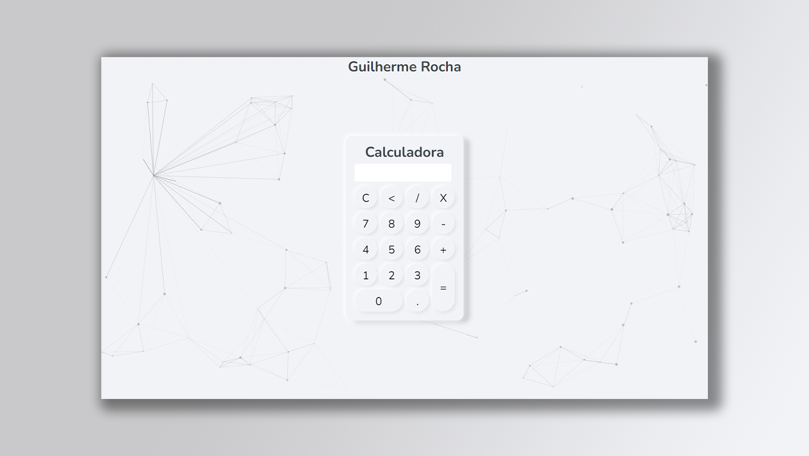

    

<h1 align="center"> Calculadora com Javascript</h1>

    <a href="#sobre">Sobre</a> • 
    <a href="#features">Features</a> • 
    <a href="#demo">Demo</a> •  
    <a href="#tecnologias">Tecnologias</a> • 
    <a href="#licenca">Lincença</a> • 
    <a href="#autor">Autor</a> 

### Sobre

Uma calculadora com todas as operações matemáticas como: (adição, subtração, multiplicação, divisão) com botões de limpar tela, remoção de cada digito digitado e igualdade. Feita com html, css e javascript puro. 

### Caracteristicas principais

- [x] Adição
- [x] Subtração
- [x] Multiplicação
- [x] Divisão

### Demo
<h1 align="center">
    
</h1>

(Preview)

### Tecnologias

As seguintes ferramentas 🛠 foram usadas na construção do projeto:

<table>
    <tr>
        <td><a href="https://www.javascript.com/">Javascript</a></td>
        <td><a href="https://html.com/">HTML</a></td>
        <td><a href="https://www.w3schools.com/css/">CSS</a></td>
        <td><a href="https://vincentgarreau.com/particles.js/">Particle js</a></td>
    </tr>
    <tr>
        <td>ECMAScript 2018</td>
        <td>5.2</td>
        <td>2.1</td>
        <td>2.0.0</td>
    </tr>
</table>

### Licenca

A calculadora é um software de código aberto licenciado sob a [MIT license](http://opensource.org/licenses/MIT).

### Autor

> Created by GUILHERME ROCHA 👉[See my LinkedIn](https://www.linkedin.com/in/guilherme-rocha-7b3a69220/) • GitHub [@Guilherme-devcode](https://github.com/Guilherme-devcode)
